# InErgize Component Architecture Diagrams

## Component Overview

This document provides detailed component diagrams for each major service in the InErgize system, showing internal architecture, data flows, and integration points.

## 1. Authentication & User Management Components

### Authentication Service Internal Architecture

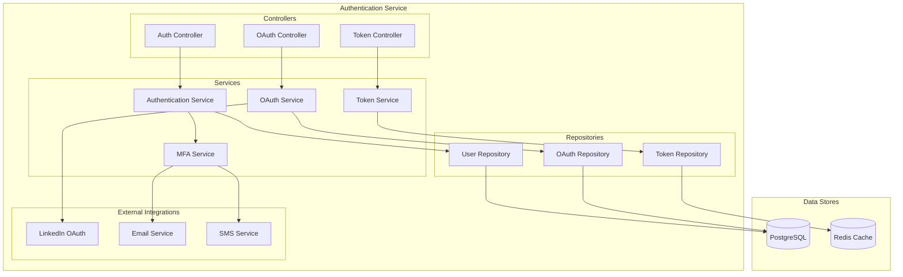

### User Management Service Internal Architecture

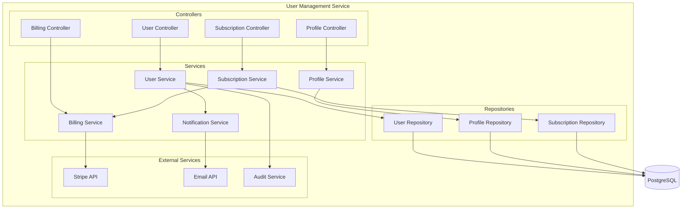

## 2. LinkedIn Integration Service Components

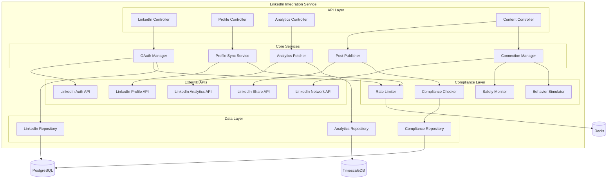

### LinkedIn API Rate Limiting Component

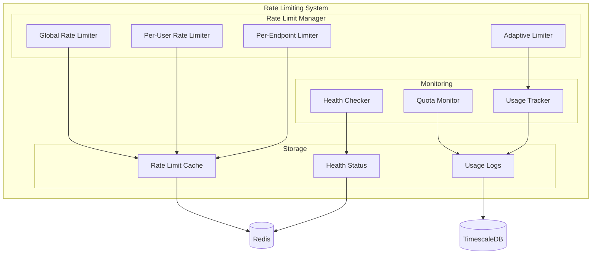

## 3. AI Content Generation Service Components

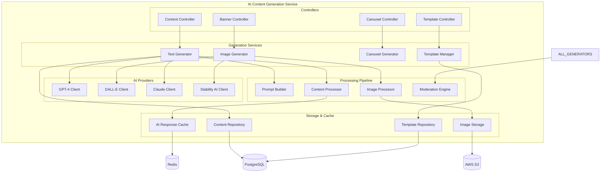

### AI Pipeline Flow

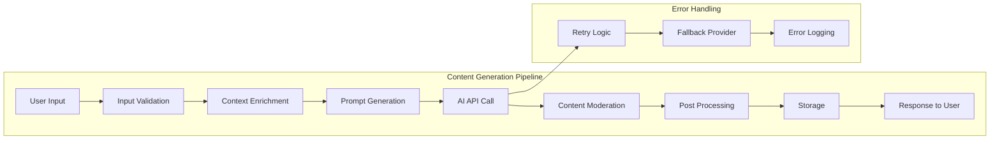

## 4. Analytics Service Components

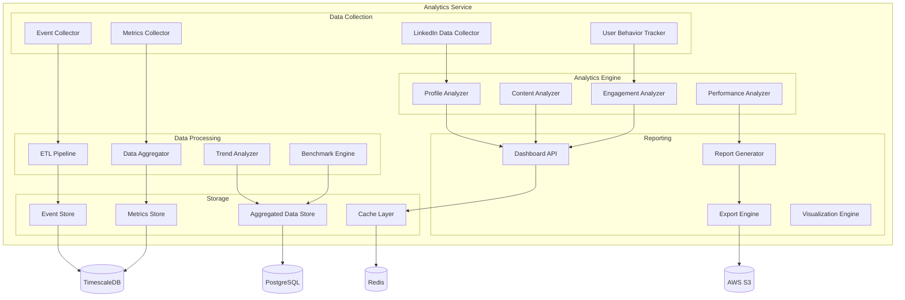

### Real-time Analytics Pipeline

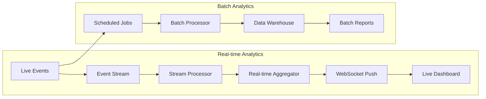

## 5. Scheduler & Automation Service Components

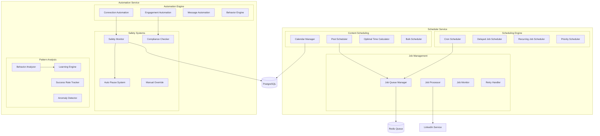

### Automation Safety Framework

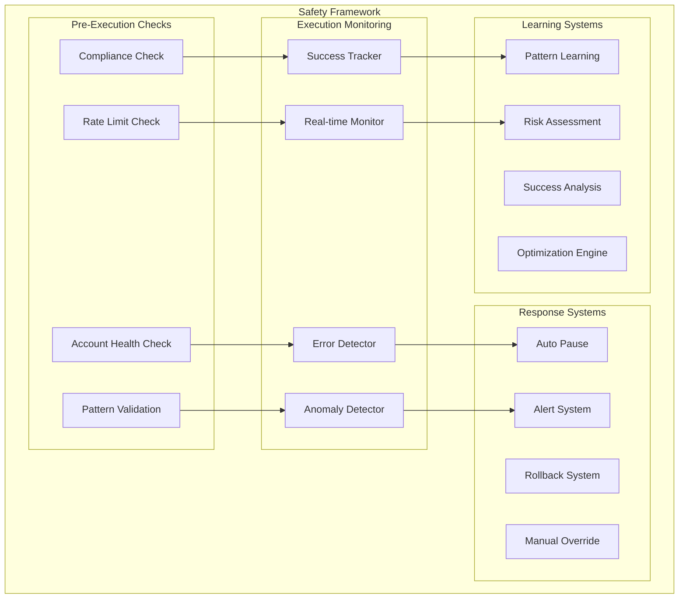

## 6. Data Flow Architecture

### User Onboarding Data Flow

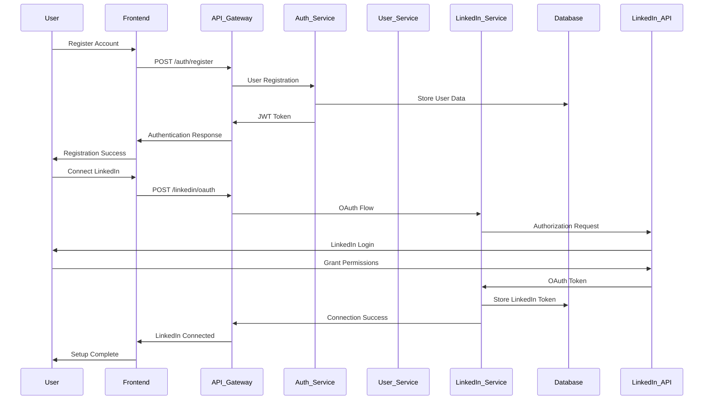

### Content Generation Data Flow

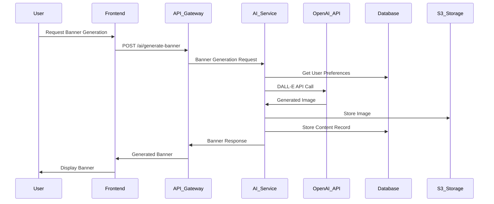

### Automation Execution Data Flow

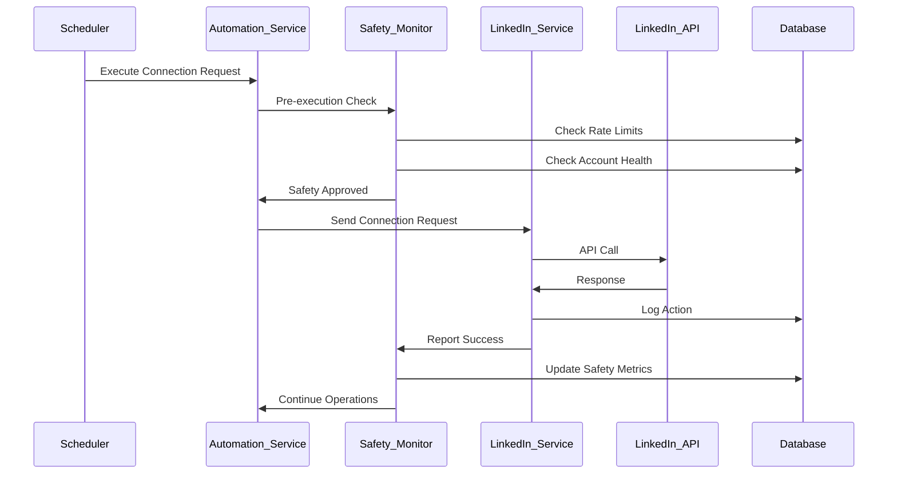

## 7. Component Integration Patterns

### Service Communication Patterns

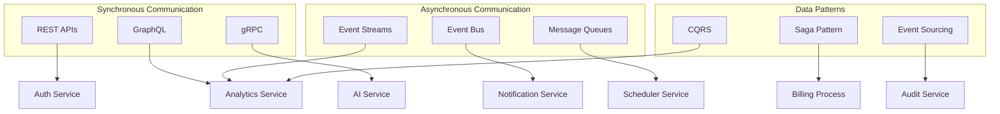

### Error Handling & Resilience Patterns

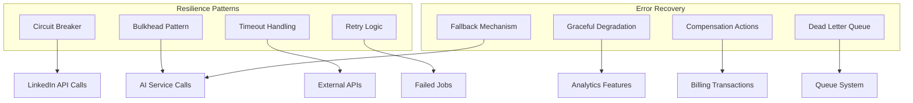

This comprehensive component architecture provides detailed insights into how each service is structured internally and how they interact with each other, forming the complete InErgize system. Each component is designed with scalability, reliability, and maintainability in mind, following microservices best practices and industry standards.