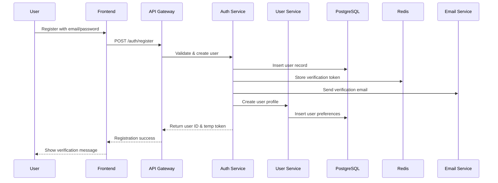
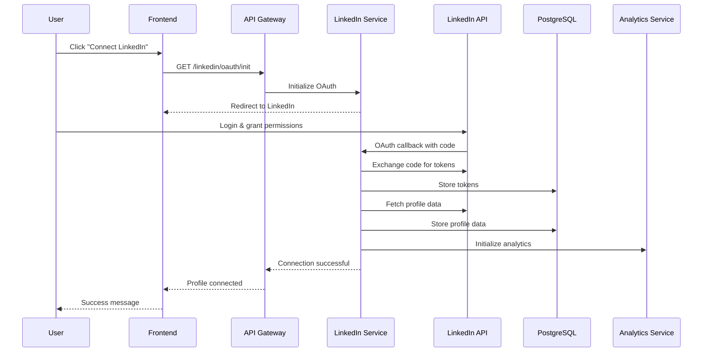
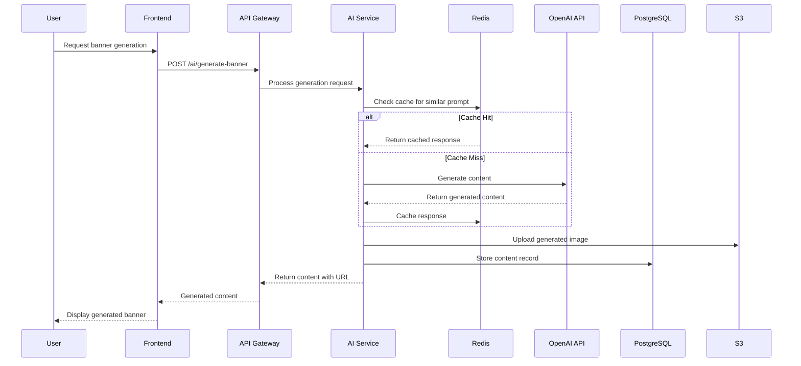
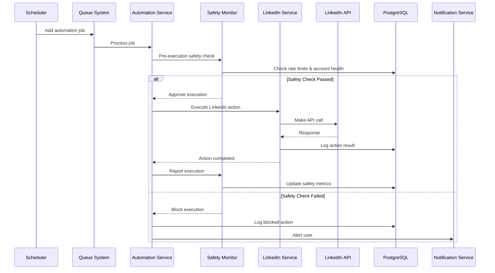
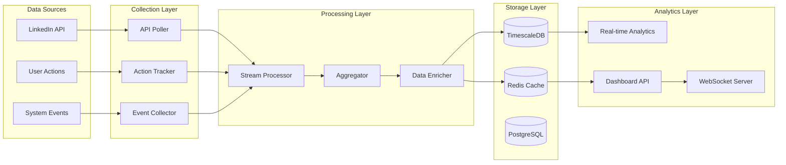

# InErgize Database Design & Data Flow Architecture

## Database Architecture Overview

InErgize uses a polyglot persistence approach with different databases optimized for specific use cases:

- **PostgreSQL**: Primary transactional data, user management, content storage
- **TimescaleDB**: Time-series analytics data, metrics, and event tracking  
- **Redis**: Caching, sessions, rate limiting, real-time data
- **Elasticsearch**: Search, logging, and complex analytics queries
- **AWS S3**: File storage for images, banners, exports

## Primary Database Schema (PostgreSQL)

### Core User Management Tables

```sql
-- Users table with comprehensive profile data
CREATE TABLE users (
    id UUID PRIMARY KEY DEFAULT gen_random_uuid(),
    email VARCHAR(255) UNIQUE NOT NULL,
    password_hash VARCHAR(255) NOT NULL,
    first_name VARCHAR(100) NOT NULL,
    last_name VARCHAR(100) NOT NULL,
    subscription_tier VARCHAR(50) DEFAULT 'free' CHECK (subscription_tier IN ('free', 'basic', 'premium', 'enterprise')),
    subscription_status VARCHAR(50) DEFAULT 'active' CHECK (subscription_status IN ('active', 'cancelled', 'suspended', 'trial')),
    subscription_expires_at TIMESTAMP,
    linkedin_connected BOOLEAN DEFAULT false,
    timezone VARCHAR(100) DEFAULT 'UTC',
    language VARCHAR(10) DEFAULT 'en',
    avatar_url VARCHAR(500),
    phone VARCHAR(20),
    is_verified BOOLEAN DEFAULT false,
    is_active BOOLEAN DEFAULT true,
    last_login_at TIMESTAMP,
    created_at TIMESTAMP DEFAULT NOW(),
    updated_at TIMESTAMP DEFAULT NOW()
);

-- User preferences and settings
CREATE TABLE user_preferences (
    id UUID PRIMARY KEY DEFAULT gen_random_uuid(),
    user_id UUID REFERENCES users(id) ON DELETE CASCADE,
    notification_email BOOLEAN DEFAULT true,
    notification_push BOOLEAN DEFAULT true,
    auto_sync_linkedin BOOLEAN DEFAULT true,
    optimal_posting_enabled BOOLEAN DEFAULT true,
    automation_enabled BOOLEAN DEFAULT false,
    ai_suggestions_enabled BOOLEAN DEFAULT true,
    privacy_level VARCHAR(20) DEFAULT 'standard' CHECK (privacy_level IN ('minimal', 'standard', 'enhanced')),
    preferences_data JSONB DEFAULT '{}',
    created_at TIMESTAMP DEFAULT NOW(),
    updated_at TIMESTAMP DEFAULT NOW()
);

-- User sessions and authentication
CREATE TABLE user_sessions (
    id UUID PRIMARY KEY DEFAULT gen_random_uuid(),
    user_id UUID REFERENCES users(id) ON DELETE CASCADE,
    session_token VARCHAR(255) UNIQUE NOT NULL,
    refresh_token VARCHAR(255) UNIQUE NOT NULL,
    device_info JSONB,
    ip_address INET,
    user_agent TEXT,
    expires_at TIMESTAMP NOT NULL,
    is_active BOOLEAN DEFAULT true,
    created_at TIMESTAMP DEFAULT NOW(),
    last_accessed_at TIMESTAMP DEFAULT NOW()
);

-- Multi-factor authentication
CREATE TABLE user_mfa (
    id UUID PRIMARY KEY DEFAULT gen_random_uuid(),
    user_id UUID REFERENCES users(id) ON DELETE CASCADE,
    method VARCHAR(20) NOT NULL CHECK (method IN ('totp', 'sms', 'email')),
    secret_key VARCHAR(255),
    phone_number VARCHAR(20),
    email VARCHAR(255),
    is_verified BOOLEAN DEFAULT false,
    is_enabled BOOLEAN DEFAULT false,
    backup_codes TEXT[],
    created_at TIMESTAMP DEFAULT NOW(),
    updated_at TIMESTAMP DEFAULT NOW()
);
```

### LinkedIn Integration Tables

```sql
-- LinkedIn profile data and OAuth tokens
CREATE TABLE linkedin_profiles (
    id UUID PRIMARY KEY DEFAULT gen_random_uuid(),
    user_id UUID REFERENCES users(id) ON DELETE CASCADE,
    linkedin_id VARCHAR(100) UNIQUE NOT NULL,
    profile_url VARCHAR(500),
    headline VARCHAR(500),
    summary TEXT,
    industry VARCHAR(200),
    location VARCHAR(200),
    profile_picture_url VARCHAR(500),
    banner_url VARCHAR(500),
    connections_count INTEGER DEFAULT 0,
    followers_count INTEGER DEFAULT 0,
    profile_data JSONB DEFAULT '{}',
    analytics_data JSONB DEFAULT '{}',
    completeness_score INTEGER DEFAULT 0,
    last_sync_at TIMESTAMP,
    sync_frequency_hours INTEGER DEFAULT 24,
    is_active BOOLEAN DEFAULT true,
    created_at TIMESTAMP DEFAULT NOW(),
    updated_at TIMESTAMP DEFAULT NOW()
);

-- OAuth tokens and refresh data
CREATE TABLE linkedin_tokens (
    id UUID PRIMARY KEY DEFAULT gen_random_uuid(),
    user_id UUID REFERENCES users(id) ON DELETE CASCADE,
    access_token TEXT NOT NULL,
    refresh_token TEXT,
    token_type VARCHAR(50) DEFAULT 'Bearer',
    scope TEXT,
    expires_at TIMESTAMP,
    refresh_expires_at TIMESTAMP,
    is_valid BOOLEAN DEFAULT true,
    created_at TIMESTAMP DEFAULT NOW(),
    updated_at TIMESTAMP DEFAULT NOW()
);

-- LinkedIn API usage tracking
CREATE TABLE linkedin_api_usage (
    id UUID PRIMARY KEY DEFAULT gen_random_uuid(),
    user_id UUID REFERENCES users(id) ON DELETE CASCADE,
    endpoint VARCHAR(200) NOT NULL,
    method VARCHAR(10) NOT NULL,
    status_code INTEGER NOT NULL,
    response_time_ms INTEGER,
    rate_limit_remaining INTEGER,
    rate_limit_reset TIMESTAMP,
    request_data JSONB,
    response_data JSONB,
    error_message TEXT,
    created_at TIMESTAMP DEFAULT NOW()
);
```

### Content Management Tables

```sql
-- Generated content (posts, banners, carousels)
CREATE TABLE content (
    id UUID PRIMARY KEY DEFAULT gen_random_uuid(),
    user_id UUID REFERENCES users(id) ON DELETE CASCADE,
    type VARCHAR(50) NOT NULL CHECK (type IN ('post', 'carousel', 'banner', 'article')),
    title VARCHAR(255),
    content JSONB NOT NULL,
    ai_prompt TEXT,
    template_id UUID,
    status VARCHAR(50) DEFAULT 'draft' CHECK (status IN ('draft', 'scheduled', 'published', 'failed', 'archived')),
    scheduled_at TIMESTAMP,
    published_at TIMESTAMP,
    linkedin_post_id VARCHAR(100),
    analytics JSONB DEFAULT '{}',
    metadata JSONB DEFAULT '{}',
    tags VARCHAR(50)[],
    is_template BOOLEAN DEFAULT false,
    created_at TIMESTAMP DEFAULT NOW(),
    updated_at TIMESTAMP DEFAULT NOW()
);

-- Content templates for reuse
CREATE TABLE content_templates (
    id UUID PRIMARY KEY DEFAULT gen_random_uuid(),
    user_id UUID REFERENCES users(id), -- NULL for system templates
    name VARCHAR(255) NOT NULL,
    description TEXT,
    type VARCHAR(50) NOT NULL,
    industry VARCHAR(100),
    category VARCHAR(100),
    template_data JSONB NOT NULL,
    preview_image_url VARCHAR(500),
    usage_count INTEGER DEFAULT 0,
    is_public BOOLEAN DEFAULT false,
    is_active BOOLEAN DEFAULT true,
    created_at TIMESTAMP DEFAULT NOW(),
    updated_at TIMESTAMP DEFAULT NOW()
);

-- Content performance tracking
CREATE TABLE content_performance (
    id UUID PRIMARY KEY DEFAULT gen_random_uuid(),
    content_id UUID REFERENCES content(id) ON DELETE CASCADE,
    metric_type VARCHAR(50) NOT NULL CHECK (metric_type IN ('views', 'likes', 'comments', 'shares', 'clicks')),
    metric_value INTEGER NOT NULL DEFAULT 0,
    recorded_at TIMESTAMP DEFAULT NOW(),
    source VARCHAR(50) DEFAULT 'linkedin'
);

-- AI generation logs
CREATE TABLE ai_generation_logs (
    id UUID PRIMARY KEY DEFAULT gen_random_uuid(),
    user_id UUID REFERENCES users(id) ON DELETE CASCADE,
    content_id UUID REFERENCES content(id) ON DELETE SET NULL,
    ai_provider VARCHAR(50) NOT NULL CHECK (ai_provider IN ('openai', 'anthropic', 'stability')),
    model_name VARCHAR(100) NOT NULL,
    prompt TEXT NOT NULL,
    response TEXT,
    tokens_used INTEGER,
    cost_cents INTEGER,
    generation_time_ms INTEGER,
    status VARCHAR(50) NOT NULL CHECK (status IN ('success', 'failed', 'moderated')),
    error_message TEXT,
    metadata JSONB DEFAULT '{}',
    created_at TIMESTAMP DEFAULT NOW()
);
```

### Automation and Scheduling Tables

```sql
-- Automation rules and settings
CREATE TABLE automation_rules (
    id UUID PRIMARY KEY DEFAULT gen_random_uuid(),
    user_id UUID REFERENCES users(id) ON DELETE CASCADE,
    name VARCHAR(255) NOT NULL,
    type VARCHAR(50) NOT NULL CHECK (type IN ('connection_request', 'post_engagement', 'message_sequence', 'content_sharing')),
    is_enabled BOOLEAN DEFAULT false,
    configuration JSONB NOT NULL,
    target_criteria JSONB DEFAULT '{}',
    safety_limits JSONB NOT NULL,
    schedule JSONB DEFAULT '{}',
    created_at TIMESTAMP DEFAULT NOW(),
    updated_at TIMESTAMP DEFAULT NOW()
);

-- Automation execution logs
CREATE TABLE automation_logs (
    id UUID PRIMARY KEY DEFAULT gen_random_uuid(),
    user_id UUID REFERENCES users(id) ON DELETE CASCADE,
    rule_id UUID REFERENCES automation_rules(id) ON DELETE SET NULL,
    action_type VARCHAR(100) NOT NULL,
    target_linkedin_id VARCHAR(100),
    target_data JSONB DEFAULT '{}',
    status VARCHAR(50) NOT NULL CHECK (status IN ('success', 'failed', 'pending', 'skipped')),
    response_data JSONB DEFAULT '{}',
    error_message TEXT,
    retry_count INTEGER DEFAULT 0,
    executed_at TIMESTAMP DEFAULT NOW()
);

-- Scheduled jobs
CREATE TABLE scheduled_jobs (
    id UUID PRIMARY KEY DEFAULT gen_random_uuid(),
    user_id UUID REFERENCES users(id) ON DELETE CASCADE,
    job_type VARCHAR(100) NOT NULL,
    job_data JSONB NOT NULL,
    status VARCHAR(50) DEFAULT 'pending' CHECK (status IN ('pending', 'processing', 'completed', 'failed', 'cancelled')),
    priority INTEGER DEFAULT 0,
    scheduled_for TIMESTAMP NOT NULL,
    started_at TIMESTAMP,
    completed_at TIMESTAMP,
    retry_count INTEGER DEFAULT 0,
    max_retries INTEGER DEFAULT 3,
    error_message TEXT,
    result_data JSONB,
    created_at TIMESTAMP DEFAULT NOW(),
    updated_at TIMESTAMP DEFAULT NOW()
);

-- Content calendar events
CREATE TABLE content_calendar (
    id UUID PRIMARY KEY DEFAULT gen_random_uuid(),
    user_id UUID REFERENCES users(id) ON DELETE CASCADE,
    content_id UUID REFERENCES content(id) ON DELETE CASCADE,
    event_date DATE NOT NULL,
    event_time TIME,
    timezone VARCHAR(100),
    status VARCHAR(50) DEFAULT 'scheduled',
    notes TEXT,
    created_at TIMESTAMP DEFAULT NOW(),
    updated_at TIMESTAMP DEFAULT NOW()
);
```

### Compliance and Safety Tables

```sql
-- Compliance monitoring and violations
CREATE TABLE compliance_logs (
    id UUID PRIMARY KEY DEFAULT gen_random_uuid(),
    user_id UUID REFERENCES users(id) ON DELETE CASCADE,
    check_type VARCHAR(100) NOT NULL,
    status VARCHAR(50) NOT NULL CHECK (status IN ('pass', 'warning', 'violation', 'critical')),
    details JSONB NOT NULL,
    action_taken VARCHAR(100),
    resolved_at TIMESTAMP,
    created_at TIMESTAMP DEFAULT NOW()
);

-- Account safety monitoring
CREATE TABLE account_health (
    id UUID PRIMARY KEY DEFAULT gen_random_uuid(),
    user_id UUID REFERENCES users(id) ON DELETE CASCADE,
    health_score INTEGER NOT NULL CHECK (health_score >= 0 AND health_score <= 100),
    risk_level VARCHAR(20) NOT NULL CHECK (risk_level IN ('low', 'medium', 'high', 'critical')),
    factors JSONB NOT NULL,
    recommendations JSONB DEFAULT '{}',
    last_checked_at TIMESTAMP DEFAULT NOW(),
    created_at TIMESTAMP DEFAULT NOW(),
    updated_at TIMESTAMP DEFAULT NOW()
);

-- Rate limiting tracking
CREATE TABLE rate_limit_usage (
    id UUID PRIMARY KEY DEFAULT gen_random_uuid(),
    user_id UUID REFERENCES users(id) ON DELETE CASCADE,
    resource_type VARCHAR(100) NOT NULL,
    used_quota INTEGER NOT NULL DEFAULT 0,
    max_quota INTEGER NOT NULL,
    reset_period_start TIMESTAMP NOT NULL,
    reset_period_end TIMESTAMP NOT NULL,
    created_at TIMESTAMP DEFAULT NOW(),
    updated_at TIMESTAMP DEFAULT NOW()
);
```

### Analytics and Reporting Tables

```sql
-- User analytics summary
CREATE TABLE user_analytics_summary (
    id UUID PRIMARY KEY DEFAULT gen_random_uuid(),
    user_id UUID REFERENCES users(id) ON DELETE CASCADE,
    date DATE NOT NULL,
    profile_views INTEGER DEFAULT 0,
    search_appearances INTEGER DEFAULT 0,
    post_impressions INTEGER DEFAULT 0,
    post_engagement INTEGER DEFAULT 0,
    connection_invites_sent INTEGER DEFAULT 0,
    connection_invites_received INTEGER DEFAULT 0,
    messages_sent INTEGER DEFAULT 0,
    messages_received INTEGER DEFAULT 0,
    created_at TIMESTAMP DEFAULT NOW(),
    UNIQUE(user_id, date)
);

-- Industry benchmarks
CREATE TABLE industry_benchmarks (
    id UUID PRIMARY KEY DEFAULT gen_random_uuid(),
    industry VARCHAR(100) NOT NULL,
    metric_name VARCHAR(100) NOT NULL,
    metric_value DECIMAL(10,2) NOT NULL,
    percentile INTEGER CHECK (percentile >= 0 AND percentile <= 100),
    sample_size INTEGER NOT NULL,
    date_range_start DATE NOT NULL,
    date_range_end DATE NOT NULL,
    created_at TIMESTAMP DEFAULT NOW(),
    updated_at TIMESTAMP DEFAULT NOW()
);

-- Export jobs for reports
CREATE TABLE export_jobs (
    id UUID PRIMARY KEY DEFAULT gen_random_uuid(),
    user_id UUID REFERENCES users(id) ON DELETE CASCADE,
    export_type VARCHAR(50) NOT NULL CHECK (export_type IN ('profile_analytics', 'content_performance', 'automation_logs')),
    format VARCHAR(20) NOT NULL CHECK (format IN ('pdf', 'excel', 'csv', 'json')),
    date_range_start DATE,
    date_range_end DATE,
    filters JSONB DEFAULT '{}',
    status VARCHAR(50) DEFAULT 'pending' CHECK (status IN ('pending', 'processing', 'completed', 'failed')),
    file_url VARCHAR(500),
    file_size_bytes INTEGER,
    error_message TEXT,
    expires_at TIMESTAMP,
    created_at TIMESTAMP DEFAULT NOW(),
    completed_at TIMESTAMP
);
```

## Time Series Database Schema (TimescaleDB)

```sql
-- Real-time analytics events (hypertable)
CREATE TABLE analytics_events (
    time TIMESTAMPTZ NOT NULL DEFAULT NOW(),
    user_id UUID NOT NULL,
    event_type VARCHAR(50) NOT NULL,
    event_category VARCHAR(50) NOT NULL,
    properties JSONB DEFAULT '{}',
    session_id VARCHAR(255),
    ip_address INET,
    user_agent TEXT
);

SELECT create_hypertable('analytics_events', 'time');

-- Profile metrics time series
CREATE TABLE profile_metrics (
    time TIMESTAMPTZ NOT NULL DEFAULT NOW(),
    user_id UUID NOT NULL,
    metric_type VARCHAR(50) NOT NULL,
    metric_value INTEGER NOT NULL,
    previous_value INTEGER,
    change_delta INTEGER
);

SELECT create_hypertable('profile_metrics', 'time');

-- LinkedIn API performance metrics
CREATE TABLE api_performance_metrics (
    time TIMESTAMPTZ NOT NULL DEFAULT NOW(),
    user_id UUID,
    endpoint VARCHAR(200) NOT NULL,
    response_time_ms INTEGER NOT NULL,
    status_code INTEGER NOT NULL,
    rate_limit_remaining INTEGER,
    error_type VARCHAR(100)
);

SELECT create_hypertable('api_performance_metrics', 'time');

-- Content engagement time series
CREATE TABLE content_engagement_metrics (
    time TIMESTAMPTZ NOT NULL DEFAULT NOW(),
    content_id UUID NOT NULL,
    user_id UUID NOT NULL,
    metric_type VARCHAR(50) NOT NULL,
    metric_value INTEGER NOT NULL DEFAULT 0,
    organic BOOLEAN DEFAULT true
);

SELECT create_hypertable('content_engagement_metrics', 'time');

-- Create indexes for common queries
CREATE INDEX idx_analytics_events_user_time ON analytics_events (user_id, time DESC);
CREATE INDEX idx_analytics_events_type_time ON analytics_events (event_type, time DESC);
CREATE INDEX idx_profile_metrics_user_metric_time ON profile_metrics (user_id, metric_type, time DESC);
CREATE INDEX idx_api_performance_endpoint_time ON api_performance_metrics (endpoint, time DESC);
CREATE INDEX idx_content_engagement_content_time ON content_engagement_metrics (content_id, time DESC);
```

## Redis Data Structures

### Session Management
```redis
# User sessions with expiration
SET session:${sessionId} '{"userId":"uuid","data":"..."}' EX 86400

# Active user sessions
SADD user:${userId}:sessions ${sessionId}

# Session metadata
HSET session:${sessionId}:meta 
     "lastAccessed" "timestamp"
     "ipAddress" "127.0.0.1"
     "userAgent" "browser_info"
```

### Rate Limiting
```redis
# LinkedIn API rate limits per user
HSET linkedin_rate_limit:${userId}
     "profile_api" "remaining_calls"
     "share_api" "remaining_calls"
     "network_api" "remaining_calls"
     "reset_time" "timestamp"

# Daily automation limits
SET automation_limit:${userId}:${date} ${count} EX 86400
```

### Real-time Analytics Cache
```redis
# Live profile metrics
HSET profile_live:${userId}
     "views_today" "count"
     "connections_today" "count"
     "engagement_today" "count"
     "last_updated" "timestamp"

# Content performance cache
ZADD content_performance:${userId} ${score} ${contentId}
```

### AI Response Caching
```redis
# Cache AI-generated content responses
SET ai_cache:${promptHash} '{"response":"...","metadata":"..."}' EX 3600

# Track AI usage for billing
HINCRBY ai_usage:${userId}:${month} "gpt4_tokens" ${tokens}
HINCRBY ai_usage:${userId}:${month} "dalle_images" 1
```

### Queue Management
```redis
# Job queues with priorities
LPUSH queue:high_priority '{"jobId":"...","data":"..."}'
LPUSH queue:normal_priority '{"jobId":"...","data":"..."}'
LPUSH queue:low_priority '{"jobId":"...","data":"..."}'

# Processing status
SET job:${jobId}:status "processing" EX 3600
```

## Data Flow Architecture

### User Registration Flow


### LinkedIn Integration Flow


### AI Content Generation Flow


### Automation Execution Flow


### Real-time Analytics Pipeline


## Database Performance Optimization

### Indexing Strategy
```sql
-- User-related indexes
CREATE INDEX CONCURRENTLY idx_users_email_hash ON users USING hash(email);
CREATE INDEX CONCURRENTLY idx_users_subscription ON users(subscription_tier, subscription_status) WHERE is_active = true;
CREATE INDEX CONCURRENTLY idx_user_sessions_token ON user_sessions USING hash(session_token);

-- LinkedIn integration indexes
CREATE INDEX CONCURRENTLY idx_linkedin_profiles_user_id ON linkedin_profiles(user_id);
CREATE INDEX CONCURRENTLY idx_linkedin_tokens_expires ON linkedin_tokens(expires_at) WHERE is_valid = true;
CREATE INDEX CONCURRENTLY idx_api_usage_user_date ON linkedin_api_usage(user_id, created_at);

-- Content indexes
CREATE INDEX CONCURRENTLY idx_content_user_status ON content(user_id, status);
CREATE INDEX CONCURRENTLY idx_content_scheduled ON content(scheduled_at) WHERE status = 'scheduled';
CREATE INDEX CONCURRENTLY idx_content_type_created ON content(type, created_at);

-- Analytics indexes
CREATE INDEX CONCURRENTLY idx_analytics_summary_user_date ON user_analytics_summary(user_id, date DESC);
CREATE INDEX CONCURRENTLY idx_automation_logs_user_executed ON automation_logs(user_id, executed_at DESC);

-- Partial indexes for active data
CREATE INDEX CONCURRENTLY idx_active_automations ON automation_rules(user_id) WHERE is_enabled = true;
CREATE INDEX CONCURRENTLY idx_pending_jobs ON scheduled_jobs(scheduled_for, priority DESC) WHERE status = 'pending';
```

### Partitioning Strategy
```sql
-- Partition large tables by date
CREATE TABLE analytics_events_template (
    LIKE analytics_events INCLUDING ALL
) PARTITION BY RANGE (created_at);

-- Create monthly partitions
CREATE TABLE analytics_events_2024_01 PARTITION OF analytics_events_template
    FOR VALUES FROM ('2024-01-01') TO ('2024-02-01');

CREATE TABLE analytics_events_2024_02 PARTITION OF analytics_events_template
    FOR VALUES FROM ('2024-02-01') TO ('2024-03-01');

-- Automated partition management
CREATE OR REPLACE FUNCTION create_monthly_partition(table_name text, start_date date)
RETURNS void AS $$
DECLARE
    partition_name text;
    end_date date;
BEGIN
    end_date := start_date + interval '1 month';
    partition_name := table_name || '_' || to_char(start_date, 'YYYY_MM');
    
    EXECUTE format('CREATE TABLE %I PARTITION OF %I FOR VALUES FROM (%L) TO (%L)',
                   partition_name, table_name, start_date, end_date);
END;
$$ LANGUAGE plpgsql;
```

### Data Retention Policies
```sql
-- Create data retention policies
CREATE OR REPLACE FUNCTION cleanup_old_data()
RETURNS void AS $$
BEGIN
    -- Delete old session data
    DELETE FROM user_sessions WHERE expires_at < NOW() - INTERVAL '7 days';
    
    -- Archive old automation logs (keep last 6 months)
    DELETE FROM automation_logs WHERE executed_at < NOW() - INTERVAL '6 months';
    
    -- Clean up old API usage logs (keep last 3 months)
    DELETE FROM linkedin_api_usage WHERE created_at < NOW() - INTERVAL '3 months';
    
    -- Archive old analytics events to separate table
    WITH old_events AS (
        DELETE FROM analytics_events 
        WHERE time < NOW() - INTERVAL '1 year'
        RETURNING *
    )
    INSERT INTO analytics_events_archive SELECT * FROM old_events;
    
    -- Update statistics
    ANALYZE;
END;
$$ LANGUAGE plpgsql;

-- Schedule cleanup job
SELECT cron.schedule('cleanup-old-data', '0 2 * * *', 'SELECT cleanup_old_data();');
```

## Data Security & Compliance

### Encryption at Rest
```sql
-- Enable transparent data encryption for sensitive columns
ALTER TABLE users ALTER COLUMN password_hash TYPE text USING pgp_sym_encrypt(password_hash, 'encryption_key');
ALTER TABLE linkedin_tokens ALTER COLUMN access_token TYPE text USING pgp_sym_encrypt(access_token, 'encryption_key');

-- Create secure views for sensitive data
CREATE VIEW users_secure AS
SELECT 
    id,
    email,
    first_name,
    last_name,
    subscription_tier,
    linkedin_connected,
    created_at
FROM users 
WHERE is_active = true;
```

### Audit Trail Implementation
```sql
-- Create audit trigger function
CREATE OR REPLACE FUNCTION audit_trigger_function()
RETURNS trigger AS $$
BEGIN
    IF TG_OP = 'INSERT' THEN
        INSERT INTO audit_log (table_name, operation, new_data, user_id, timestamp)
        VALUES (TG_TABLE_NAME, TG_OP, to_jsonb(NEW), NEW.user_id, NOW());
        RETURN NEW;
    ELSIF TG_OP = 'UPDATE' THEN
        INSERT INTO audit_log (table_name, operation, old_data, new_data, user_id, timestamp)
        VALUES (TG_TABLE_NAME, TG_OP, to_jsonb(OLD), to_jsonb(NEW), NEW.user_id, NOW());
        RETURN NEW;
    ELSIF TG_OP = 'DELETE' THEN
        INSERT INTO audit_log (table_name, operation, old_data, user_id, timestamp)
        VALUES (TG_TABLE_NAME, TG_OP, to_jsonb(OLD), OLD.user_id, NOW());
        RETURN OLD;
    END IF;
END;
$$ LANGUAGE plpgsql;

-- Apply audit triggers to sensitive tables
CREATE TRIGGER audit_users AFTER INSERT OR UPDATE OR DELETE ON users
    FOR EACH ROW EXECUTE FUNCTION audit_trigger_function();

CREATE TRIGGER audit_linkedin_profiles AFTER INSERT OR UPDATE OR DELETE ON linkedin_profiles
    FOR EACH ROW EXECUTE FUNCTION audit_trigger_function();
```

This comprehensive database design provides a robust foundation for the InErgize platform, ensuring data integrity, performance, security, and compliance while supporting all the core features and future scalability requirements.