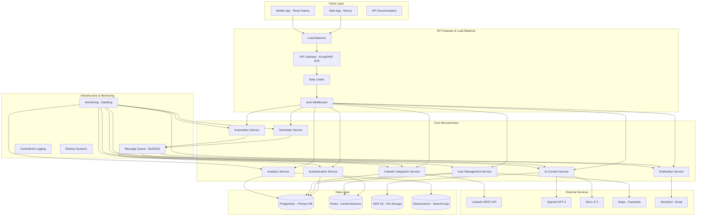
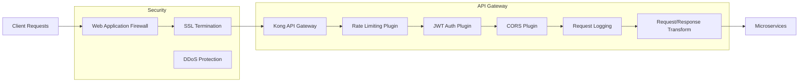
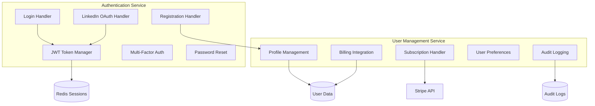
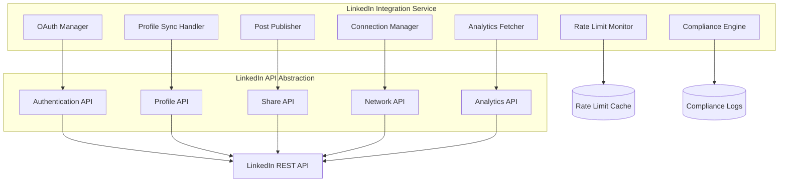
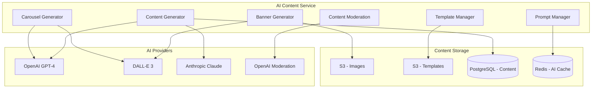
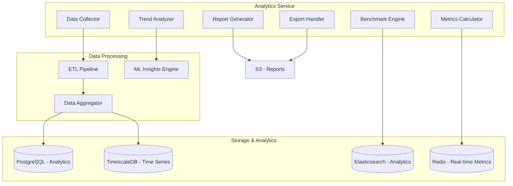
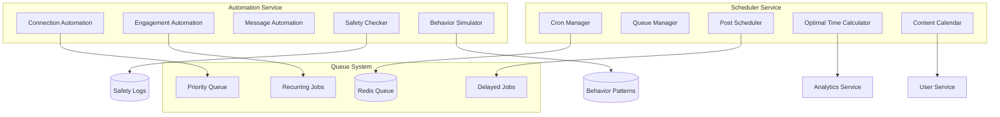
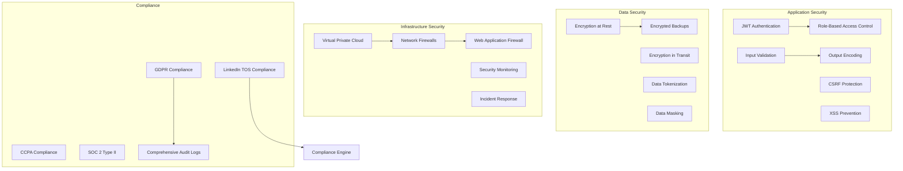
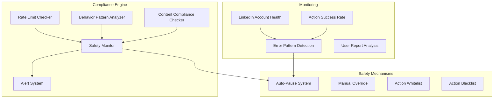

# InErgize System Architecture Design

## Executive Summary

InErgize is a comprehensive LinkedIn optimization SaaS platform designed with a microservices architecture to ensure scalability, maintainability, and compliance with LinkedIn's terms of service. The system leverages AI for content generation, provides real-time analytics, and includes sophisticated automation features with built-in safety mechanisms.

## High-Level System Architecture



## Detailed Service Architecture

### 1. API Gateway & Security Layer



**Key Features:**
- **Rate Limiting**: Global and per-user rate limits to protect LinkedIn API quotas
- **Authentication**: JWT-based authentication with refresh tokens
- **Request Transformation**: Standardize requests/responses across services
- **Monitoring**: Real-time API metrics and alerting
- **Security**: WAF, DDoS protection, and SSL termination

### 2. Authentication & User Management Services



**Key Features:**
- **Multi-Authentication**: Email/password, LinkedIn OAuth, MFA
- **Token Management**: JWT with refresh tokens, secure session handling
- **Subscription Management**: Freemium model with usage tracking
- **Audit Trail**: Complete user action logging for compliance

### 3. LinkedIn Integration Service



**Key Features:**
- **Rate Limit Management**: Intelligent rate limiting with LinkedIn quotas
- **Error Handling**: Robust error handling with exponential backoff
- **Compliance Monitoring**: Real-time compliance checking and alerting
- **Token Management**: Automatic token refresh and validation

### 4. AI Content Generation Service



**Key Features:**
- **Multi-Provider Support**: OpenAI, Anthropic, with fallback capabilities
- **Content Moderation**: Automatic content filtering and compliance checking
- **Template System**: Industry-specific templates and prompt optimization
- **Caching**: AI response caching to reduce costs and improve performance

### 5. Analytics & Reporting Service



**Key Features:**
- **Real-time Analytics**: Live dashboard updates with WebSocket connections
- **Time Series Data**: Profile views, connections, engagement tracking
- **Benchmarking**: Industry and role-based performance comparisons
- **Export Capabilities**: PDF, Excel, CSV report generation

### 6. Automation & Scheduler Service



**Key Features:**
- **Smart Scheduling**: Optimal timing based on audience engagement patterns
- **Safety Mechanisms**: Compliance monitoring and automatic shutoffs
- **Behavior Simulation**: Human-like delays and interaction patterns
- **Queue Management**: Priority-based job processing with retry logic

## Database Design

### Primary Database Schema (PostgreSQL)

```sql
-- Users and Authentication
CREATE TABLE users (
    id UUID PRIMARY KEY DEFAULT gen_random_uuid(),
    email VARCHAR(255) UNIQUE NOT NULL,
    password_hash VARCHAR(255) NOT NULL,
    first_name VARCHAR(100) NOT NULL,
    last_name VARCHAR(100) NOT NULL,
    subscription_tier VARCHAR(50) DEFAULT 'free',
    linkedin_connected BOOLEAN DEFAULT false,
    created_at TIMESTAMP DEFAULT NOW(),
    updated_at TIMESTAMP DEFAULT NOW()
);

-- LinkedIn Profile Data
CREATE TABLE linkedin_profiles (
    id UUID PRIMARY KEY DEFAULT gen_random_uuid(),
    user_id UUID REFERENCES users(id) ON DELETE CASCADE,
    linkedin_id VARCHAR(100) UNIQUE NOT NULL,
    profile_url VARCHAR(500),
    headline VARCHAR(500),
    summary TEXT,
    profile_data JSONB,
    analytics_data JSONB,
    completeness_score INTEGER DEFAULT 0,
    last_sync_at TIMESTAMP,
    created_at TIMESTAMP DEFAULT NOW(),
    updated_at TIMESTAMP DEFAULT NOW()
);

-- Generated Content
CREATE TABLE content (
    id UUID PRIMARY KEY DEFAULT gen_random_uuid(),
    user_id UUID REFERENCES users(id) ON DELETE CASCADE,
    type VARCHAR(50) NOT NULL, -- 'post', 'carousel', 'banner'
    title VARCHAR(255),
    content JSONB NOT NULL,
    ai_prompt TEXT,
    status VARCHAR(50) DEFAULT 'draft', -- 'draft', 'scheduled', 'published', 'failed'
    scheduled_at TIMESTAMP,
    published_at TIMESTAMP,
    analytics JSONB,
    created_at TIMESTAMP DEFAULT NOW(),
    updated_at TIMESTAMP DEFAULT NOW()
);

-- Automation Logs
CREATE TABLE automation_logs (
    id UUID PRIMARY KEY DEFAULT gen_random_uuid(),
    user_id UUID REFERENCES users(id) ON DELETE CASCADE,
    action_type VARCHAR(100) NOT NULL,
    target_data JSONB,
    status VARCHAR(50) NOT NULL, -- 'success', 'failed', 'pending'
    response_data JSONB,
    executed_at TIMESTAMP DEFAULT NOW()
);

-- Analytics Data (Time Series)
CREATE TABLE analytics_events (
    id UUID PRIMARY KEY DEFAULT gen_random_uuid(),
    user_id UUID REFERENCES users(id) ON DELETE CASCADE,
    event_type VARCHAR(100) NOT NULL,
    event_data JSONB NOT NULL,
    timestamp TIMESTAMP DEFAULT NOW()
);

-- Compliance Monitoring
CREATE TABLE compliance_logs (
    id UUID PRIMARY KEY DEFAULT gen_random_uuid(),
    user_id UUID REFERENCES users(id) ON DELETE CASCADE,
    check_type VARCHAR(100) NOT NULL,
    status VARCHAR(50) NOT NULL, -- 'pass', 'warning', 'violation'
    details JSONB,
    timestamp TIMESTAMP DEFAULT NOW()
);

-- Create indexes for performance
CREATE INDEX idx_users_email ON users(email);
CREATE INDEX idx_linkedin_profiles_user_id ON linkedin_profiles(user_id);
CREATE INDEX idx_linkedin_profiles_linkedin_id ON linkedin_profiles(linkedin_id);
CREATE INDEX idx_content_user_id ON content(user_id);
CREATE INDEX idx_content_status ON content(status);
CREATE INDEX idx_content_scheduled_at ON content(scheduled_at) WHERE scheduled_at IS NOT NULL;
CREATE INDEX idx_automation_logs_user_id ON automation_logs(user_id);
CREATE INDEX idx_automation_logs_executed_at ON automation_logs(executed_at);
CREATE INDEX idx_analytics_events_user_id ON analytics_events(user_id);
CREATE INDEX idx_analytics_events_timestamp ON analytics_events(timestamp);
```

### Redis Cache Structure

```redis
# User Sessions
session:${sessionId} -> {userId, userData, expiresAt}

# LinkedIn API Rate Limits
linkedin_rate_limit:${userId} -> {remaining, resetTime, dailyLimit}

# AI Response Cache
ai_cache:${promptHash} -> {response, timestamp, expiresAt}

# Real-time Analytics
analytics:${userId}:live -> {profileViews, connections, engagement}

# Queue Jobs
bull:scheduler:waiting -> [job1, job2, ...]
bull:automation:active -> [job1, job2, ...]
```

## Security & Compliance Framework

### Security Architecture



### LinkedIn Compliance Engine



## Development Phases & Timeline

### Phase 1: Foundation (Months 1-2)

**Infrastructure & Core Services**
- [x] Set up development environment and CI/CD pipeline
- [x] Implement API Gateway with Kong or AWS API Gateway
- [x] Create Authentication Service with JWT and OAuth
- [x] Set up PostgreSQL and Redis infrastructure
- [x] Implement User Management Service
- [x] Basic LinkedIn OAuth integration

**MVP Features**
- [x] User registration and authentication
- [x] LinkedIn profile connection
- [x] Basic profile data synchronization
- [x] Simple dashboard with profile completeness score

**Deliverables:**
- Working authentication system
- LinkedIn profile connection
- Basic user dashboard
- Infrastructure monitoring setup

### Phase 2: Analytics & Core Features (Months 3-4)

**Analytics Foundation**
- [x] Implement Analytics Service
- [x] Create data collection and aggregation pipelines
- [x] Build real-time metrics dashboard
- [x] Implement basic reporting features

**Profile Optimization**
- [x] AI-powered profile analysis
- [x] Headline and summary suggestions
- [x] Skills recommendations
- [x] Profile completeness roadmap

**Deliverables:**
- Analytics dashboard with real-time data
- Profile optimization recommendations
- Basic AI content suggestions
- Performance metrics tracking

### Phase 3: Content Generation (Months 5-6)

**AI Content Services**
- [x] Implement AI Content Service
- [x] Integrate OpenAI GPT-4 for text generation
- [x] Integrate DALL-E 3 for banner creation
- [x] Build content moderation pipeline

**Content Creation Tools**
- [x] Banner generation with templates
- [x] Post content suggestions
- [x] Carousel post creator
- [x] Content calendar interface

**Deliverables:**
- AI banner generation tool
- Content suggestion engine
- Carousel post creator
- Content library and templates

### Phase 4: Automation & Scheduling (Months 7-8)

**Scheduler Service**
- [x] Implement post scheduling system
- [x] Optimal timing recommendations
- [x] Bulk scheduling capabilities
- [x] Content calendar management

**Safe Automation**
- [x] Connection request automation
- [x] Post engagement automation
- [x] Compliance monitoring system
- [x] Safety mechanisms and auto-pause

**Deliverables:**
- Post scheduling system
- Safe automation features
- Compliance monitoring dashboard
- Account safety mechanisms

### Phase 5: Advanced Features (Months 9-10)

**Advanced Analytics**
- [x] Competitive benchmarking
- [x] Trend analysis and insights
- [x] Performance optimization suggestions
- [x] Advanced reporting and exports

**Enhanced AI**
- [x] Personalized content recommendations
- [x] Industry-specific templates
- [x] A/B testing capabilities
- [x] Content performance optimization

**Deliverables:**
- Advanced analytics dashboard
- Competitive benchmarking
- A/B testing features
- Enhanced AI recommendations

### Phase 6: Scale & Enterprise (Months 11-12)

**Scalability & Performance**
- [x] Performance optimization
- [x] Auto-scaling implementation
- [x] Advanced caching strategies
- [x] Database optimization

**Enterprise Features**
- [x] Team collaboration tools
- [x] White-label solutions
- [x] Advanced compliance features
- [x] Enterprise integrations

**Deliverables:**
- Scalable architecture
- Team collaboration features
- Enterprise-ready platform
- Advanced compliance tools

## Technical Specifications

### Performance Requirements

| Metric | Target | Monitoring |
|--------|---------|------------|
| API Response Time | < 200ms (95th percentile) | DataDog APM |
| Dashboard Load Time | < 2 seconds | Real User Monitoring |
| AI Content Generation | < 10 seconds | Custom metrics |
| Database Query Time | < 50ms average | PostgreSQL logs |
| Cache Hit Rate | > 80% | Redis metrics |
| Uptime SLA | 99.9% | Uptime monitoring |

### Scalability Targets

| Component | Current Capacity | Target Capacity | Scaling Strategy |
|-----------|------------------|-----------------|-------------------|
| API Gateway | 1,000 RPS | 10,000 RPS | Horizontal scaling |
| Database | 100 connections | 1,000 connections | Read replicas |
| Redis Cache | 1GB memory | 10GB memory | Redis Cluster |
| AI Services | 100 requests/min | 1,000 requests/min | Queue-based processing |
| File Storage | 100GB | 10TB | AWS S3 with CDN |

### Security Measures

| Area | Implementation | Compliance |
|------|----------------|------------|
| Data Encryption | AES-256 at rest, TLS 1.3 in transit | SOC 2, GDPR |
| Authentication | JWT with refresh tokens, OAuth 2.0 | Industry standard |
| Authorization | RBAC with fine-grained permissions | Custom implementation |
| Input Validation | Schema validation, SQL injection prevention | OWASP guidelines |
| API Security | Rate limiting, CORS, CSRF protection | Security best practices |
| Audit Logging | Complete user action logging | Compliance requirements |

## Monitoring & Observability

### Application Monitoring

```yaml
Metrics:
  - API response times and error rates
  - Database performance and connection pooling
  - Cache hit rates and memory usage
  - AI service response times and costs
  - LinkedIn API rate limit consumption
  - User engagement and feature adoption

Logging:
  - Structured JSON logging with correlation IDs
  - Centralized log aggregation with ELK stack
  - Application-level logs and system metrics
  - Security events and audit trails
  - Error tracking with Sentry integration

Alerting:
  - Real-time alerts for system failures
  - Performance degradation notifications
  - LinkedIn API compliance violations
  - Security incident alerts
  - Resource utilization warnings
```

### Business Intelligence

```yaml
User Metrics:
  - Daily/Monthly Active Users (DAU/MAU)
  - User acquisition and conversion rates
  - Feature adoption and usage patterns
  - Churn rate and retention analysis
  - Subscription tier conversion rates

Product Metrics:
  - Content generation volume and success rates
  - Profile optimization completion rates
  - Automation usage and safety metrics
  - LinkedIn integration health scores
  - Support ticket volume and resolution times

Business Metrics:
  - Monthly Recurring Revenue (MRR)
  - Customer Acquisition Cost (CAC)
  - Lifetime Value (LTV)
  - Net Promoter Score (NPS)
  - Operational cost per user
```

## Deployment Architecture

### Container Orchestration (Kubernetes)

```yaml
apiVersion: apps/v1
kind: Deployment
metadata:
  name: inergize-api-gateway
spec:
  replicas: 3
  selector:
    matchLabels:
      app: api-gateway
  template:
    metadata:
      labels:
        app: api-gateway
    spec:
      containers:
      - name: kong
        image: kong:latest
        ports:
        - containerPort: 8000
        - containerPort: 8443
        env:
        - name: KONG_DATABASE
          value: postgres
        - name: KONG_PG_HOST
          value: postgres-service
        resources:
          requests:
            memory: "256Mi"
            cpu: "250m"
          limits:
            memory: "512Mi"
            cpu: "500m"
```

### Environment Configuration

```yaml
Development:
  - Single-node Kubernetes cluster (minikube/k3s)
  - PostgreSQL single instance
  - Redis single instance
  - Mock external services for testing
  - Local file storage

Staging:
  - Multi-node Kubernetes cluster
  - PostgreSQL with read replica
  - Redis cluster (3 nodes)
  - Real external services with test accounts
  - AWS S3 for file storage

Production:
  - Highly available Kubernetes cluster (3+ nodes)
  - PostgreSQL with multiple read replicas
  - Redis cluster with backup
  - Production external services
  - Multi-region AWS S3 with CDN
```

This comprehensive system architecture provides a robust foundation for the InErgize LinkedIn optimization platform, ensuring scalability, security, and compliance with LinkedIn's terms of service while delivering powerful AI-powered features to users.